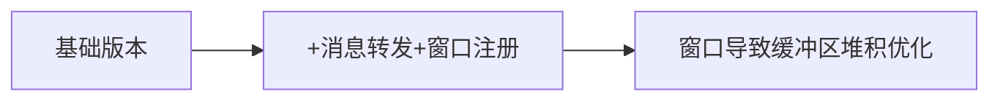

 
<b><a href="README.md">简体中文</a> | <a href="README_EN.md">English</a></b>

# VioletClient 🚀

客户端使用Qt进行开发，目前支持匿名模式，登录模式。服务端地址： [Violet](https://github.com/witnesswish/Violet.git)

    一个C++聊天客户端 

    一个练习项目，服务端有部署，可以尝试连接测试 

## 编译
1. 下载源码
2. 使用Qt Creator打包编译，开发版本为Qt 6.9
3. 如果需要自行打包并且不依赖Qt，直接照常cmake就行，需要自行处理依赖哦

## 体验打包好的版本
>如果有很大的更新，比如增加功能之类的，会推更新
1. 提供Windows 64位编译版本
2. 提供Android armeabi-v7a版本，因为我手上的手机就是这个架构的，顺带编译了，其它版本需自行编译
3. 安卓版本没有优化，体验只能说极其糟糕，但是能正常用，并且不打算优化，不是我的领域范围，就不浪费这个时间了
4. Linux 版本自行打包

## 技术架构
版本演化：

