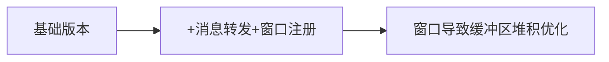

 
<b><a href="README.md">简体中文</a> | <a href="README_EN.md">English</a></b>

# VioletClient 🚀

客户端使用Qt进行开发，目前支持匿名模式，登录模式。服务端地址： [Violet](https://github.com/witnesswish/Violet.git)

    一个C++聊天客户端 

    一个练习项目，服务端有部署，可以尝试连接测试 

## 编译
1. 下载源码
2. 使用Qt Creator打包编译，开发版本为Qt 6.9

## 技术架构
版本演化：

```mermaid
graph LR
    v1.0[基础版本] --> v1.1[+消息转发+窗口注册]
    v1.1 --> v1.2[窗口导致缓冲区堆积优化]
```
