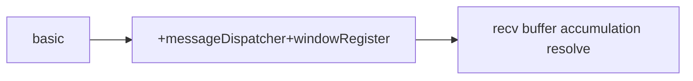

 
<b><a href="README.md">简体中文</a> | <a href="README_EN.md">English</a></b>

# VioletClient 🚀

This soft is based on Qt 6.9, and it's a client of Violet server, Server project： [Violet](https://github.com/witnesswish/Violet.git)

    A c++ chat soft client

    A practice porject, server has been deployed, try it on

## compile
1. downlad the source code
2. compile with Qt Creator, dev version is based on Qt 6.9

## structure
version：

